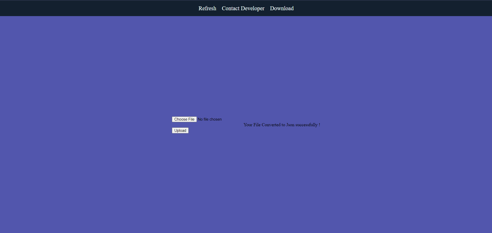

# Aditya Raj

## Table of Contents
* [General Info](#general-information)
* [Technologies Used](#technologies-used)
* [Features](#features)
* [Screenshots](#screenshots)
* [Setup](#setup)
* [Project Status](#project-status)
* [Contact](#contact)

## General Information
This web application helps users and even developers to convert .xls, .xlsx, and .csv files to .json format file.
User can download the converted json file from this application.

## Technologies Used
- Python, Django

## Features
- Simple UI
- User-friendly 

## Screenshots

## Setup
Extract the given zipped file. You may use Winrar for this. 
Open the extracted folder and open exl2json folder.
Open cmd and type : python manage.py runserver (assuming you have installed django on your environment/computer).
For sample output of the webapp, go to img/output folder for screenshots 
of the site.

## Project Status
 _completed_

## Contact
- Project By: **Aditya Raj**.
- <a href="mailto:araj.mishra2000@gmail.com">Email Me</a>